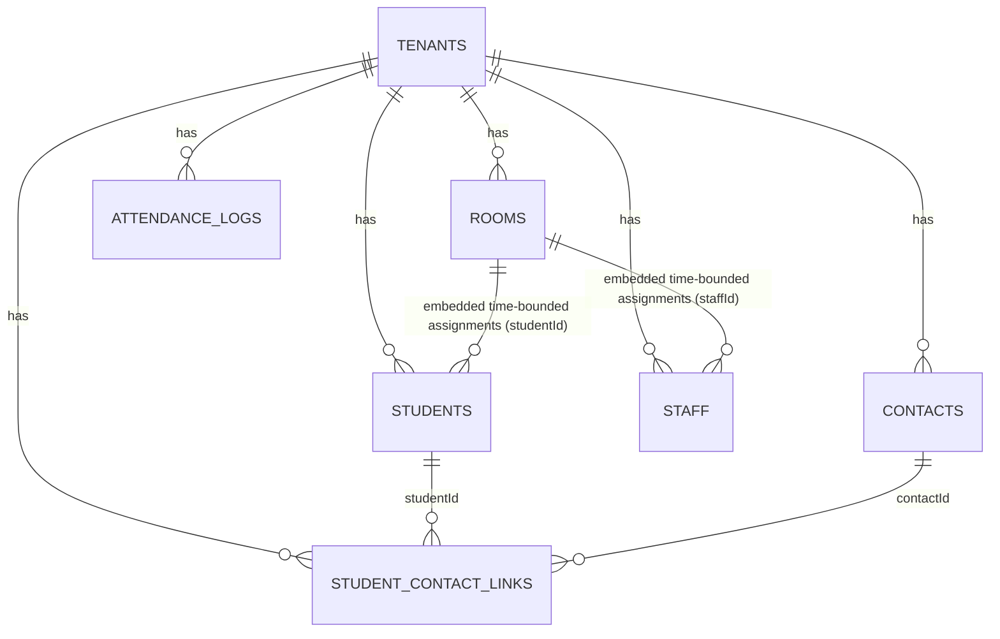

---

# Schema Overview (ERD, Responsibilities, Relationships)

> This document is the **first-stop map** of the data layer. It tells an AI (and humans) *what lives where*, *why it’s shaped that way*, and *how to read/write safely* across the multi-tenant boundary.

---

## 💠 Global Conventions

* **Multi-tenant invariants**

  * Every collection requires: `tenantId:ObjectId`, `tenantCode:string`, `schemaVersion:int`, `audit:{createdAt,createdBy,updatedAt,updatedBy[,deleted…]}`.
  * **All reads/writes must filter by `tenantId`.** `tenantCode` is for logs/exports and human-friendly joins.
* **Null vs Missing**

  * **Known empty** → `null`. **Unknown/not applicable** → omit field.
* **Soft delete**

  * Use `audit.deleted` and/or `audit.deletedAt`; readers should exclude deleted by default.
* **Authority vs cache**

  * Collections hold **authoritative** data; some docs embed **read-optimized snapshots** (e.g., `students.contactsLite[]`) used for UI speed. **Never drive rules/permissions from caches.**
* **IDs**

  * Use Mongo `ObjectId` for entities/refs. Human codes (e.g., `rooms.room.code`, `tenants.tenantCode`) are unique **per tenant** via indexes.

---

## 🗺️ ERD (high level)



> **Note:** Room↔Student/Staff assignments are stored **inside `rooms`** as **time-bounded arrays** (`effectiveFrom`/`effectiveTo`) to preserve history and avoid a separate link table.

---

## 📦 Collections & Responsibilities

### 1) `tenants` (v1) — **Configuration Brain**

* **Purpose:** One doc per school/daycare. Branding, policies (enrollment/pickup/attendance), programs & ratios, billing/tax, notifications, integrations.
* **Read-mostly**; updated by admins.
* **Key fields:** `school{ name, timeZone, branding, license(capacity) }`, `programs[]`, `billing{currency,...}`, `tax{rates[]}`, `policies`, `features`.
* **Used by:** Invoicing, attendance windows, pickup policy, FE theming, localization.

### 2) `students` (v2.1) — **Child Record**

* **Purpose:** Canonical student identity, school/enrollment metadata, medical/immunization, audit.
* **Cache:** `contactsLite[]` (optional, UI-only snapshot of linked people).
  Authority for people/roles is **not** here.
* **Key fields:** `student{name, gender, birthday{y,m,d}, birthdayDate}`, `school{status, schedule, studentId?}`, `medical`, `attachments`, `contactsLite?[]`.
* **Writes:** Never mutate relationships here; use `student_contact_links`.

### 3) `contacts` (v2) — **Person**

* **Purpose:** One doc per person (guardian/family/pickup). Optional login/account state.
* **Key fields:** `profile{name, email?, phones[], address?}`, `account{status, lastLoginAt?}`, `pickup{defaultCode?}`, `billing?`.
* **Used by:** Messaging, login, billing payers, pickup defaults.

### 4) `student_contact_links` (v2) — **Relationship Layer**

* **Purpose:** Per-student **role** for a contact + **capabilities**, **invite status**, **per-student pickup code override**, optional **billing share** and **legal flags**.
* **Uniqueness:** One link per `(tenantId, studentId, contactId)`.
* **Key fields:** `role: guardian|family|pickup`, `capabilities{ canPickup, ... }`, `invite{status,...}`, `pickupCode{override?}`, `billingForThisStudent{isPayer?, percent?}`.
* **Authority for permissions & roles lives here.**

### 5) `rooms` (v1) — **Classroom/Space**

* **Purpose:** Room identity, age band, **capacity & ratio**, operating **schedule**, and **time-bounded assignments** of staff and students.
* **Key fields:** `room{name, code?, status, minAgeMonths, maxAgeMonths, capacity.maxStudents, ratio.studentsPerStaff, schedule{mon..sun}}`,
  `assignments{ staff[], students[] }` with `{effectiveFrom, effectiveTo?}`.
* **Derived server logic:** capacity left, required staff, current roster.

### 6) `staff` (v1) — **Employee**

* **Purpose:** Staff identity, employment details, work schedule, payroll meta, optional login account.
* **Key fields:** `profile{ name, email?, phones[], status }`, `employment{ position, role, hireDate, workSchedule{mon..sun}, roomAssignments[] }`, `account?`.

### 7) *`attendance_logs` (planned)* — **Check-ins/outs**

* **Purpose:** Event log per student/staff with method (kiosk/QR/RFID/mobile), timestamp, and actor.
* **Key fields (likely):** `subjectType`, `subjectId`, `roomId?`, `method`, `inOut`, `occurredAt`, `source`.

---

## 🔗 Key Relationships & Invariants

* **Tenant boundary**

  * Every entity belongs to exactly one tenant. **Never** join across tenants.
* **Student ↔ Contact (through Links)**

  * `student_contact_links` is the **truth** for **roles**, **permissions**, and **invite state** per student.
  * **Effective pickup code** resolution (server-computed):

    ```
    links.pickupCode.override ?? contacts.pickup.defaultCode ?? null
    ```
* **Room ↔ Student/Staff**

  * Stored as **historical assignments** inside the room:

    * Current = `effectiveTo == null` or `effectiveTo > now`.
    * Moving a student/staff: close old assignment (`effectiveTo=now`), append a new one in the target room.
* **Age eligibility**

  * Enroll only if `room.minAgeMonths ≤ studentAgeMonths ≤ room.maxAgeMonths`.
* **Uniqueness**

  * `(tenantId, room.code)` unique (sparse).
  * `(tenantId, room.name)` unique.
  * `(tenantId, studentId, contactId)` unique in `student_contact_links`.
  * `(tenantId, contacts.profile.email)` **partial** unique if used for login.

---

## 🧭 Canonical Read Patterns (server)

* **Roster with guardians (for a room)**

  1. Fetch room by `{tenantId, _id}`; filter `assignments.students` to “current”.
  2. `$lookup` links by `studentId` with `role:"guardian"`.
  3. `$lookup` contacts by `contactId`.
  4. Project UI rows (include **effectivePickupCode** using override→default).

* **Student detail (UI-ready)**

  1. `students.findOne({tenantId, _id})`.
  2. `$lookup` links by `studentId`; `$lookup` contacts; compute effective codes.
  3. Optionally update `contactsLite[]` cache.

* **Approved pickups list (by student)**

  * Links where `capabilities.canPickup=true` (role may be `guardian` or `pickup`).

---

## ✍️ Canonical Write Patterns (server)

* **Add/Update contact for a student**

  * Upsert `contacts` (by verified email if present) → Upsert `student_contact_links` for `(studentId, contactId)` with desired `role` & `capabilities` → Rebuild `students.contactsLite[]`.

* **Move student between rooms**

  * In source room: set `effectiveTo=now` on the student’s assignment.
  * In destination room: push `{studentId, status:"enrolled", effectiveFrom: now}`.
  * (Optional) Transaction across two room docs.

* **Invite guardian**

  * Update `student_contact_links.invite.status="invited", invitedAt=now` and/or `contacts.account.status="invited"`; do **not** duplicate to `students`.

---

## 🔍 Indexing Strategy (cheat sheet)

* **tenants**

  * `{tenantId:1, tenantCode:1}` unique; `{tenantId:1, "school.name":1}` unique; `{tenantId:1, status:1}`.

* **students**

  * `{tenantId:1, "school.status":1}`
  * `{tenantId:1, "student.name.last":1, "student.name.first":1}`
  * `{tenantId:1, "school.studentId":1}` unique (partial where present)
  * `{tenantId:1, "rooms.homeRoomId":1}` (if used)

* **contacts**

  * `{tenantId:1, "profile.email":1}` **partial unique** where `account.status ∈ {"invited","active"}` (or where email exists)
  * `{tenantId:1, "profile.name.last":1, "profile.name.first":1}`

* **student_contact_links**

  * `{tenantId:1, studentId:1, contactId:1}` unique
  * `{tenantId:1, studentId:1, role:1}`
  * `{tenantId:1, contactId:1, role:1}`
  * `{tenantId:1, "pickupCode.override":1}` unique sparse

* **rooms**

  * `{tenantId:1, "room.code":1}` unique sparse
  * `{tenantId:1, "room.name":1}` unique
  * `{tenantId:1, "room.status":1}`
  * `{tenantId:1, "assignments.staff.staffId":1}`
  * `{tenantId:1, "assignments.students.studentId":1}`

* **staff**

  * `{tenantId:1, "profile.email":1}` unique sparse
  * `{tenantId:1, "profile.status":1}`
  * `{tenantId:1, "employment.position":1}`
  * `{tenantId:1, "employment.roomAssignments.roomId":1}`

---

## 🧮 Server-Computed Fields (don’t store)

* `students`: **age in months**, **effectivePickupCode** (via links+contacts), **linksCount** (optional cache).
* `rooms`: **activeStudents**, **requiredStaff = ceil(activeStudents / studentsPerStaff)**, **capacityLeft**.
* `tenants`: **currentOpenHours** for a given date (from `hours` + `closures`).

---

## 🔐 RBAC & Safety (data layer expectations)

* Role checks happen in the API layer; data schemas don’t enforce RBAC.
* Never infer authorization from `students.contactsLite[]`; use `student_contact_links.capabilities`.
* Mask/redact PII (emails/phones) in logs; include `{tenantId, actorUserId, studentId?, contactId?}` for traceability.

---

## 🔁 Versioning & Migrations

* Each collection has `schemaVersion`. Bump it when structure/semantics change.
* Use **collMod** with validators + **idempotent index scripts**.
* Typical migrations:

  * `students v2 → v2.1`: introduce `contactsLite[]`, backfill from links+contacts.
  * Introducing new `rooms` constraints or moving embedded fields (v1→v2) should include backfills.

---

## ⚠️ Anti-Patterns to Avoid

* Writing relationship/permission fields into `students` or `contacts` directly.
  → Use `student_contact_links`.
* Trusting `contactsLite[]` for anything other than **display**.
  → It’s a cache; rebuild whenever contacts or links change.
* Cross-tenant queries or updates.
  → Always include `tenantId` in predicates and index prefixes.
* Storing computed aggregates long-term (capacity used, counts).
  → Compute on read or cache with TTL if truly needed.

---

## ✅ Quick Checklist (for AI agents)

* Include `tenantId` in **every** query/filter and index prefix.
* Use **link table** (`student_contact_links`) for roles/permissions/pickup code override.
* Populate FE lists via **server-computed** DTOs; don’t recalc permissions client-side.
* Keep validators strict, but prefer `$jsonSchema` (no `$expr`) for seed-heavy environments.
* Maintain audit fields on every write; prefer soft delete.

---
